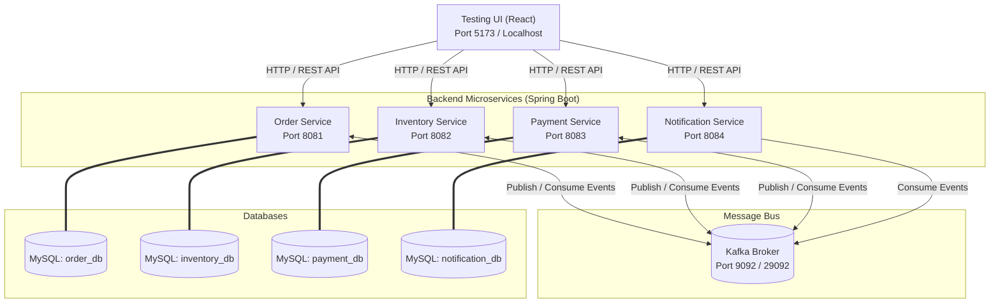

# Event-Driven Order Processing Platform

A robust, enterprise-grade distributed order processing system built with **Spring Boot**, **Apache Kafka**, and **MySQL**. This platform demonstrates event-driven microservices architecture utilizing the **Choreographed Saga Pattern** for transaction management, Spring Kafka retry mechanisms with **exponential backoff**, **Dead Letter Queue (DLQ)** error handling, and a React-based interactive control panel.

---

## 1. System Architecture

The following diagram illustrates the relationship between the microservices, their dedicated databases, the Kafka message broker, and the React frontend test harness.



---

## 2. Choreographed Saga Pattern

To maintain data consistency across distributed database schemas, the system uses choreographed Saga execution. There is no central orchestrator; instead, services react to Kafka events published by each other.

### Saga Workflows
1. **Happy Path Workflow**: Successfully reserves inventory and processes payment, marking the order as `COMPLETED`.
2. **Compensation Workflow (Payment Failed)**: Payment failure triggers compensations. Inventory is restored to its original state, and the order is marked as `FAILED`.


---

## 3. Resilience: Retries & Dead Letter Queue (DLQ)

If a service encounters a transient failure (e.g. database locks, transient connection drops, or when a service has **Failure Mode** toggled on), Spring Kafka's `CommonErrorHandler` schedules retries using an exponential backoff strategy before routing the event to a Dead Letter Topic (DLT).

* **Retry Attempts**: 3 retries (4 total attempts)
* **Backoff Configuration**: Initial interval of `1000ms`, multiplier `2.0`, max delay `4000ms` (Attempts at +0s, +1s, +3s, +7s)
* **Dead Letter Routing**: On exhaustion, the event is routed to `payment-dlt`.
* **DLT Persistence**: A dedicated `DltConsumer` reads from the DLT and saves failed event metadata into the `failed_events` DB table for audit/reconciliation.


---

## 4. Service Port & Database Map

| Service | Host Port | Internal Container Port | Description | Database Schema |
| :--- | :--- | :--- | :--- | :--- |
| **Order Service** | `8081` | `8080` | Places and tracks orders. | `order_db` |
| **Inventory Service** | `8082` | `8080` | Manages stock reservations and catalog. | `inventory_db` |
| **Payment Service** | `8083` | `8080` | Processes transaction charges. | `payment_db` |
| **Notification Service** | `8084` | `8080` | Logs simulated text messages and email notifications. | `notification_db` |
| **Testing UI** | `5173` (Dev) | N/A | React-based visual client dashboard. | N/A |
| **Kafka Broker** | `9092` | `29092` (Internal) | KRaft mode broker for message distribution. | N/A |
| **MySQL Database** | `3307` | `3306` | Shared MySQL instance housing microservice schemas. | N/A |

---

## 5. Database Schema Structure

All schemas are initialized automatically via [init.sql](file:///c:/Users/parth/OneDrive/Desktop/Event_driven%20Order%20Processing%20Platform/init-db/init.sql):

### 1. `order_db`
* **`orders`**: Tracks purchases.
  - `id` (BIGINT, Primary Key)
  - `product_id` (BIGINT)
  - `quantity` (INT)
  - `amount` (DECIMAL)
  - `status` (`PENDING`, `INVENTORY_RESERVED`, `COMPLETED`, `FAILED`)
  - `created_at` (DATETIME)

### 2. `inventory_db`
* **`inventory`**: Tracks stock quantities.
  - `product_id` (BIGINT, Primary Key)
  - `product_name` (VARCHAR)
  - `available_quantity` (INT) - Stock available for sale
  - `reserved_quantity` (INT) - Stock currently held for pending checkouts

### 3. `payment_db`
* **`payments`**: Tracks transaction attempts.
  - `payment_id` (BIGINT, Primary Key)
  - `order_id` (BIGINT)
  - `amount` (DECIMAL)
  - `status` (`SUCCESS`, `FAILED`)
  - `created_at` (DATETIME)
* **`failed_events`**: DLQ persistence audit log.
  - `id` (BIGINT, Primary Key)
  - `event_id` (VARCHAR)
  - `topic_name` (VARCHAR)
  - `payload` (TEXT)
  - `error_message` (TEXT)
  - `failed_at` (DATETIME)

### 4. `notification_db`
* **`notifications`**: Logs communications dispatched to users.
  - `id` (BIGINT, Primary Key)
  - `order_id` (BIGINT)
  - `event_type` (VARCHAR)
  - `message` (VARCHAR)
  - `status` (VARCHAR)
  - `created_at` (DATETIME)

---

## 6. API Reference

### Order Service (`8081`)
* `POST /orders`: Place a new order.
  ```json
  {
    "productId": 1,
    "quantity": 2,
    "amount": 5000,
    "simulateInventoryFailure": false,
    "simulatePaymentFailure": false
  }
  ```
* `GET /orders`: Fetch all orders.
* `GET /orders/{id}`: Fetch single order state.
* **Swagger UI**: http://localhost:8081/swagger-ui.html

### Inventory Service (`8082`)
* `GET /inventory/products`: Retrieve catalog products & current stock.
* `PUT /inventory/failure-mode`: Toggle failure mode on/off.
  ```json
  { "enabled": true }
  ```
* **Swagger UI**: http://localhost:8082/swagger-ui.html

### Payment Service (`8083`)
* `GET /payments`: Fetch transaction database records.
* `PUT /payments/failure-mode`: Toggle runtime payment exception generation on/off.
  ```json
  { "enabled": true }
  ```
* **Swagger UI**: http://localhost:8083/swagger-ui.html

### Notification Service (`8084`)
* `GET /notifications`: Retrieve dispatch log records.
* `GET /notifications/order/{orderId}`: Get notifications by order number.
* **Swagger UI**: http://localhost:8084/swagger-ui.html

---

## 7. Step-by-Step Testing Scenarios

You can verify the choreography, compensations, and DLQ logic by executing these scenarios using the React UI or using HTTP clients (curl/Postman):

### Scenario 1: Happy Path Execution
1. Send an order request:
   ```bash
   POST http://localhost:8081/orders
   {
     "productId": 1,
     "quantity": 5,
     "amount": 12000,
     "simulateInventoryFailure": false,
     "simulatePaymentFailure": false
   }
   ```
2. **Result**: Order status transitions `PENDING` -> `INVENTORY_RESERVED` -> `COMPLETED`. Database shows stock deducted by 5 and a successful payment.

### Scenario 2: Out of Stock (Natural Inventory Failure)
1. Request a quantity that exceeds stock limit (e.g. initial stock of Gaming Laptop is 100):
   ```bash
   POST http://localhost:8081/orders
   {
     "productId": 1,
     "quantity": 150,
     "amount": 360000
   }
   ```
2. **Result**: Inventory Service publishes `inventory-failed`. Order Service consumes the event and updates Order status directly to `FAILED`. No database stock modifications occur.

### Scenario 3: Simulated Inventory Failure
1. Submit an order with `simulateInventoryFailure: true`:
   ```bash
   POST http://localhost:8081/orders
   {
     "productId": 2,
     "quantity": 3,
     "amount": 900,
     "simulateInventoryFailure": true
   }
   ```
2. **Result**: Inventory Service consumes `order-created`, bypasses reservation logic because of the flag, and publishes `inventory-failed`. Order transitions to `FAILED` with no stock held.

### Scenario 4: Simulated Payment Failure & Saga Compensation
1. Submit an order with `simulatePaymentFailure: true`:
   ```bash
   POST http://localhost:8081/orders
   {
     "productId": 3,
     "quantity": 10,
     "amount": 15000,
     "simulatePaymentFailure": true
   }
   ```
2. **Flow**:
   - Stock is successfully reserved (Available stock drops by 10, Reserved stock increases by 10).
   - Order Service updates status to `INVENTORY_RESERVED`.
   - Payment Service consumes the event, intercepts the simulation flag, writes a `FAILED` record, and publishes `payment-failed`.
   - **Compensation**: Inventory Service consumes `payment-failed` and restores stock (Available stock increases by 10, Reserved stock decreases by 10). Order Service transitions status to `FAILED`.

### Scenario 5: Retries, Exponential Backoff, and Dead Letter Queue (DLQ)
1. Toggle Payment Service **Failure Mode** on:
   ```bash
   PUT http://localhost:8083/payments/failure-mode
   { "enabled": true }
   ```
2. Submit a standard order:
   ```bash
   POST http://localhost:8081/orders
   {
     "productId": 1,
     "quantity": 1,
     "amount": 2500
   }
   ```
3. **Flow**: Inventory is reserved. Payment Service consumes the reservation, throws a `RuntimeException` (due to Failure Mode), and triggers retries at +1s, +2s, and +4s.
4. **DLQ Outcome**: After the 4th failed attempt, the event is routed to `payment-dlt`. The `DltConsumer` reads this event and inserts a record into the `failed_events` database audit table.

---

## 8. Installation & Getting Started

### Prerequisites
- Docker & Docker Compose
- Node.js (v18+) & npm

### Running the Services
1. **Start the Infrastructure and Microservices**:
   Run the following command in the root folder (where `docker-compose.yml` is located):
   ```bash
   docker-compose up --build
   ```
   *Note: This command compiles all the Java services, packages them into Docker layers, and starts MySQL, Kafka, and the four spring boot service containers. It might take a few minutes on the first run.*

2. **Start the React Control Panel Dashboard**:
   Navigate to the frontend directory:
   ```bash
   cd testing-ui
   npm install
   npm run dev
   ```
   Open the displayed localhost URL (usually `http://localhost:5173`) in your browser to interactively create orders, toggle failures, and watch Kafka events flow in real-time.
